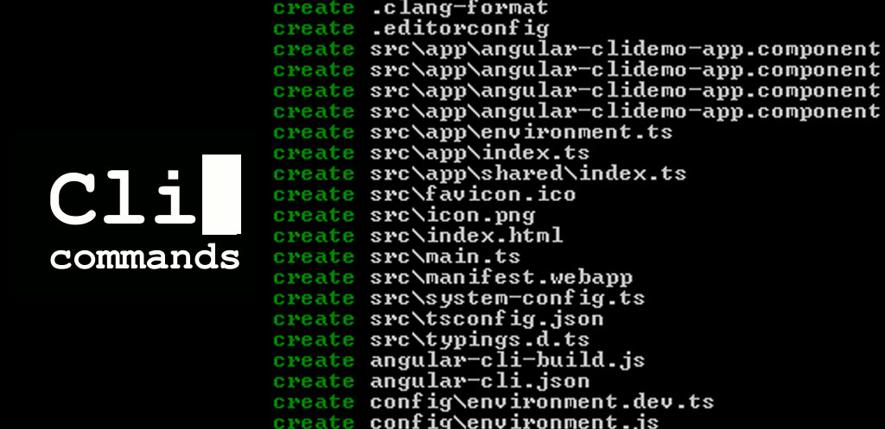

# ManPages for CLI commands



## Description
We tried to demonstrate basic to intermediate level of  using Commands for Linux and and MacOS commmnads 

## Installation
Steps to install and set up your project:

```bash
git clone https://github.com/yourusername/yourproject.git
cd yourproject
npm install
