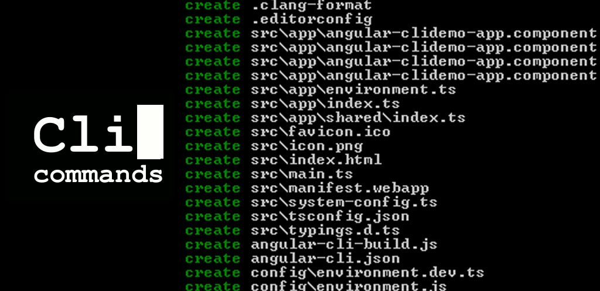

# ManPages for Software Tools (VIM, GCC, GDB)

## Introduction
The world is advancing faster than we can imagine. Keeping up with technology is easier than it seems—despite some misconceptions that make it look difficult. Our goal is to clear these misconceptions and make learning software tools more intuitive, structured, and effective.

## Software, Apps, and Tools
Software consists of **logical instructions implemented through code** to perform specific tasks. For example, an **Operating System (OS)** is a type of software that manages an entire computer system, making it a **system software**.

On the other hand, a **calculator app** on your phone is also software, but it serves a single, specific purpose—calculating. This makes it an **application software (App)**, as it is designed for a particular task.

**Tools**, unlike full software applications, are specialized utilities designed to handle specific jobs, such as text editing, code compilation, or debugging. Examples include:
- **VIM** – A powerful text editor.
- **GCC** – A compiler for C/C++ and other languages.
- **GDB** – A debugger for tracking and fixing code issues.

